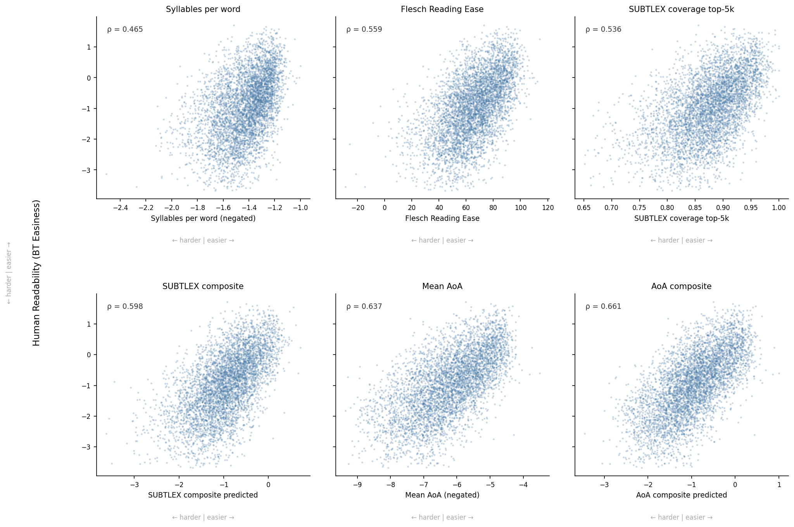
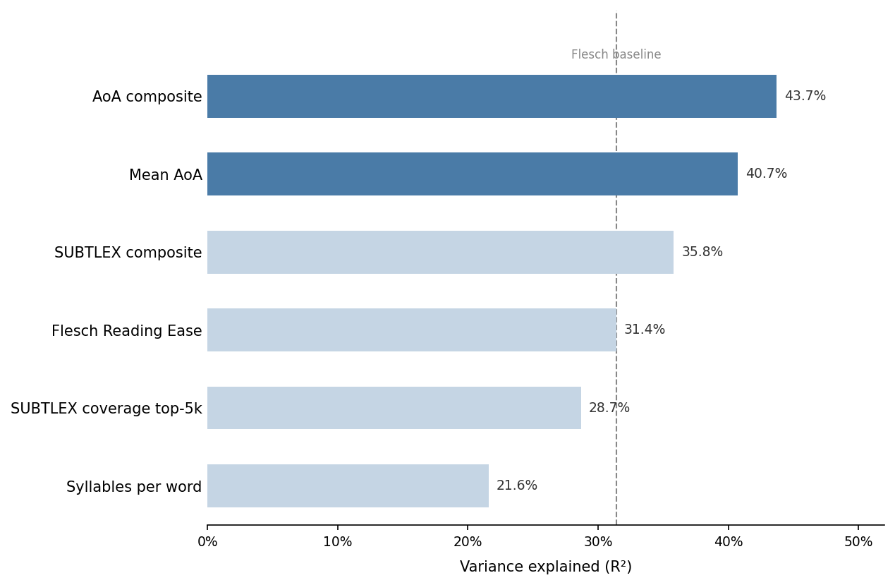

# A Readability Measure That Works

The word "ombudsman" has an Age of Acquisition of 16.62. The average native English speaker learns it at sixteen. The body whose name it is exists to protect people who cannot get justice elsewhere — people who have reached the end of their options. The word for what they have come to is one they will likely never have encountered.

This is the kind of thing a readability check should catch. The standard one does not.

## The formula

Flesch Reading Ease was published in 1948. Rudolf Flesch was working at a time when readability research meant counting by hand, and he needed a proxy for word difficulty that was quick to measure. He chose syllables. Long words are hard, short words are easy — the intuition is defensible, and for its era the formula was a real advance.

That era was seventy-five years ago. The formula has not been seriously re-examined since.

The Flesch score is calculated from two inputs: average words per sentence and average syllables per word. Sentence length is a real signal: longer sentences impose a higher working-memory load, and that effect is well established. But syllable count is a surface feature of a word, not a measure of how familiar it is to readers. The two are correlated, loosely. They are not the same thing.

The difference is systematic. "Responsibility" has six syllables and a Zipf frequency of 4.9 on the standard British English scale, putting it among the most common words in the language. Flesch penalises it. "Distress" has two syllables. Flesch passes it. Among the 15,683 Housing Ombudsman decisions in this analysis, "distress" appears 60,692 times. Among 29 Local Government and Social Care Ombudsman decisions, it appears 117 times, roughly four per decision. In a sample of Parliamentary and Health Service Ombudsman decisions, it appears in every upheld case reviewed. In every instance, it describes what the complainant experienced. It is also, on average, a word people first learn at age eleven.

Flesch never flags it.

## What Age of Acquisition measures

If syllable count is the wrong ruler, the question is what a better one would measure: not how a word is built, but when it is learned.

Age of Acquisition ratings were developed by psycholinguists studying how vocabulary is built. Kuperman et al. (2012) asked hundreds of native English speakers to rate 51,694 words: at what age do you feel you first learned this word? The results were averaged to produce a norm for each word.

This is not the same as tracking actual acquisition over time — these are retrospective judgements, subject to memory effects. But that is also why they are useful for readability. They capture perceived familiarity: how well does the average adult reader feel they know this word? That is a closer approximation of reading difficulty than counting its syllables.

AoA and word frequency capture different things. Their correlation is moderate (rho = −0.48). A word can be frequent but late-acquired. "Commission", "austerity", "coalition" and "referendum" appear constantly in public discourse but are typically learned in adolescence or later. Frequency counts their appearances; AoA catches that readers may still find them opaque.

## Testing the hypothesis

To compare AoA against Flesch, the analysis used the CLEAR corpus (Crossley et al., 2022): 4,724 texts rated for reading ease by trained teachers. This is a human-judgement criterion: texts that teachers found harder to read scored lower, and texts they found easier scored higher.

The question was simple: which measure predicts those human ratings better?

| Measure | Correlation with human ratings | Variance explained |
|---|---|---|
| AoA + sentence length | rho = 0.661 | 43.7% |
| AoA alone | rho = 0.638 | 40.7% |
| Flesch Reading Ease | rho = 0.560 | 31.4% |

The difference between the AoA composite and Flesch is statistically significant: Steiger z = 10.73, p < 0.001. On informative text, the genre closest to administrative correspondence, the gap widens further.

Within the composite, AoA does 76.5% of the work and sentence length 23.5%. The signal in Flesch's formula is almost entirely its sentence-length term. The syllable count adds noise.

*Full methods (text processing, normalisation, and the statistical tests) are in the [technical appendix](methods.md).*

## What this looks like in practice

Ombudsman decisions contain a predictable vocabulary that Flesch systematically misclassifies. Consider the words that appear most frequently across Housing Ombudsman, LGSCO, and PHSO decisions.

"Maladministration" appears in 95.8% of Housing Ombudsman decisions. It has no Age of Acquisition rating, having predated the survey instruments, but it does not appear in the top 10,000 most frequent British English words. Flesch penalises it for its syllables, which is the right answer reached by the wrong reasoning.

"Injustice" appears 14 times in a four-decision PHSO sample and 369 times across 29 LGSCO decisions. Its AoA is 10.89; it is outside the top 10,000 most frequent words in British English. It is the central concept of what the PHSO investigates, and a word most readers will first encounter well into secondary school.

The same "distress" returns here alongside "injustice", the two often sharing a sentence: *"We recognise this caused Mr G and his family significant worry and distress."* Neither troubles Flesch for its syllables; both are first learned, on average, at around eleven. They are the words that carry what the complaint is *about*, and the formula waves both through.

"Granted" appears 18 times in the same four PHSO decisions: *"was granted leave to remain"*, *"was granted funding"*. Two syllables, AoA 12.0, and again invisible to Flesch. A reader meeting the word in a legal context for the first time may not have the concept fully mapped.

The pattern is consistent across three different ombudsman bodies, different complaint categories, and different decision types. It is not an artefact of one organisation's drafting style.

## Why not something more sophisticated?

The obvious objection is that better-resourced tools exist. They do. Coh-Metrix, developed by the same research group behind the CLEAR corpus, scores text across roughly twenty-eight dimensions: lexical sophistication, cohesion, syntactic complexity, diversity, even sentiment and cognition. It is a far more elaborate instrument than a single acquisition-age lookup.

But it is an academic research tool, not something a housing officer can open in a browser. Using it means institutional access; the large language models that could do comparable work mean an API key and a cost per run; consumer editors like Hemingway apply rules they do not publish. None of them is transparent: when they flag a passage, they cannot tell the writer, in terms she can act on, *why*.

This is the point that matters. A measure used to revise public correspondence has to be inspectable: the writer needs to see that "injustice" was flagged because it is learned at eleven, not because an opaque score dropped. The checker described here is open source, free to run, and works offline in a single file. Its validation against the CLEAR corpus is public, so anyone can reproduce the numbers or contest them. It is not the most powerful readability measure available, but it is the most accountable, and for documents that decide whether a person understands the answer they have been given, that is the quality worth having.

## Limitations

This analysis has honest limits. The CLEAR corpus is literary and informative text rated by teachers for student readers — not adults reading official correspondence. No human-rated corpus of administrative prose exists; if it did, the correlation figures would likely look different.

Kuperman's norms are American English. No equivalent British database exists at scale. For most common vocabulary the divergence is modest. For politically specific terms such as "coalition", "constituency" and "devolution", it may not be.

Rated AoA is not developmental fact. Participants recalled when they felt they learned each word; that is a measure of perceived familiarity, not acquisition tracked in real time. The two correlate but are not identical.

The gold standard for plain language is testing with real readers: asking people from the intended audience to read a document and tell you where they struggle. No formula substitutes for that. Automated measures do something narrower. They approximate difficulty at scale, flag candidates for revision before a document reaches a reader, and track change over time. Used as a diagnostic rather than a verdict, a well-validated measure is useful. Used as a substitute for reader testing, any measure — including this one — will mislead.

## The larger point

Flesch became the standard because it was computable before computers existed. In 1948, that was an achievement. The formula has persisted not because subsequent research validated it for administrative writing (no such research was done) but because it was already there.

The analysis here followed a straightforward logic: take the assumed standard, specify what it should predict, test it against a criterion, and compare it with an alternative. The alternative performed significantly better. That is hardly a shock: it would have been far stranger if a syllable count from 1948 had turned out to be the best available measure of reading difficulty. The real finding is that, until now, nobody had checked.

A readability measure should predict whether readers find a text difficult. The one in common use does this less well than a measure built on how people actually learn words. For organisations whose correspondence reaches people at their most stressed and least resourced, that difference decides whether a letter can be understood by the person who most needs to understand it.

---

## References

- Crossley, S. A., Heintz, A., Choi, J. S., Batchelor, J., Karimi, M., & Malatinszky, A. (2022). A large-scaled corpus for assessing text readability. *Behavior Research Methods*, 55, 491–507.
- Flesch, R. (1948). A new readability yardstick. *Journal of Applied Psychology*, 32(3), 221–233.
- Kuperman, V., Stadthagen-Gonzalez, H., & Brysbaert, M. (2012). Age-of-acquisition ratings for 30,000 English words. *Behavior Research Methods*, 44(4), 978–990.
- Brysbaert, M. et al. (2025). Crowdsourced and AI-generated age-of-acquisition norms for vocabulary in print: Extending the Kuperman et al. (2012) norms. *Behavior Research Methods*. https://pmc.ncbi.nlm.nih.gov/articles/PMC12500800/
- van Heuven, W. J. B., Mandera, P., Keuleers, E., & Brysbaert, M. (2014). SUBTLEX-UK: A new and improved word frequency database for British English. *Quarterly Journal of Experimental Psychology*, 67(6), 1176–1190.
